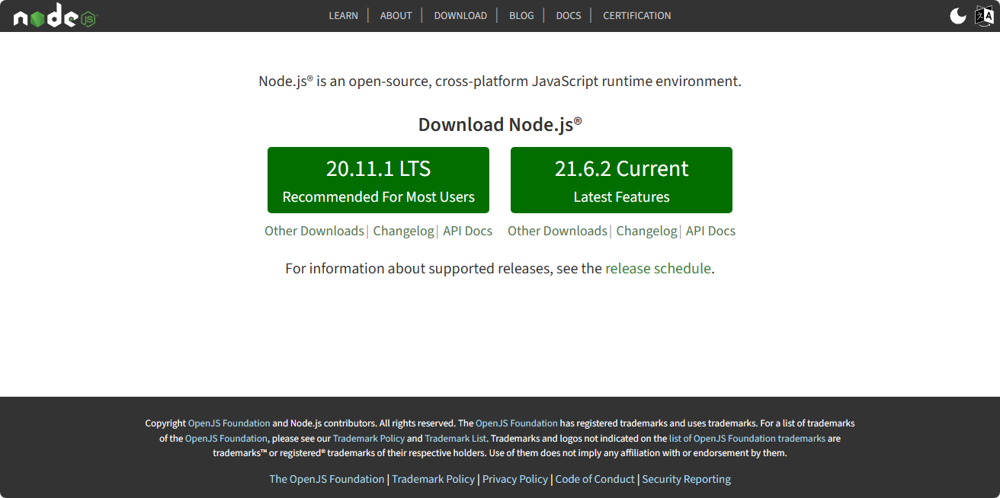
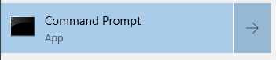
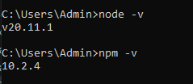

# Cài đặt NodeJS trên Windows

## 1. Download NodeJS
- Link: https://nodejs.org/en

Ý kiến cá nhân của mình thì mọi người nên cài bản được nhiều người dùng sử dụng nhất hiện tại.



## 2. Cài đặt NodeJS

Bước này khá đơn giản, mình cứ bấm Next hết nha. Hoặc nếu ai cẩn thận thì mình lên google search xem cách cài đặt cụ thể thế nào.

## 3. Kiểm tra đã cài đặt thành công hay chưa?

Có thể dùng CMD bằng cách vào Start, gõ CMD, chọn Command Prompt.



Gõ 
```tsx
node --version
npm --version
// Hoặc 
node -v
npm -v
```
Nếu thấy kết quả hiện như hình trên là mình đã cài đặt thành công NodeJS.

