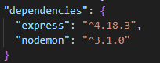

# Cài đặt NodeJS trên Windows

## 1. Download NodeJS
- Link: https://nodejs.org/en

Ý kiến cá nhân của mình thì mọi người nên cài bản được nhiều người dùng sử dụng nhất hiện tại.


## 2. Cài đặt NodeJS

Bước này khá đơn giản, mình cứ bấm Next hết nha. Hoặc nếu ai cẩn thận thì mình lên google search xem cách cài đặt cụ thể thế nào.

## 3. Kiểm tra đã cài đặt thành công hay chưa?

Có thể dùng CMD bằng cách vào Start, gõ CMD, chọn Command Prompt.


Gõ 
```tsx
node --version
npm --version
// Hoặc 
node -v
npm -v
```
Nếu thấy kết quả hiện như hình trên là mình đã cài đặt thành công NodeJS.


# Tạo project NodeJs

## 1. npm init

Đầu tiên, tạo một thư mục mới lưu project:
```
mkdir api
cd api
```
Sau đó, ```npm init``` để tạo ra file package.json, đây sẽ là file lưu các thông tin về project.

Mình sẽ nhập các thông tin liên quan đến project, hoặc  có thể nhấn "Enter" liên tục để tự động lấy các giá trị mặc định. Cuối cùng, nhấn "enter" để lưu.

Hoặc mọi người có thể gõ ```npm init -y``` để auto có file package.json luôn nha.

## 2. Cài module

Install module express: 
```npm install express```

Ngoài cài đặt module express, dòng lệnh trên sẽ lưu thông tin của module này vào file package.json.



Bên cạnh đó, mình suggest mọi người cài thêm nodemon, để khi mình có thay đổi gì, chỉ cần save lại là server sẽ tự động run lại.

```npm install nodemon```

